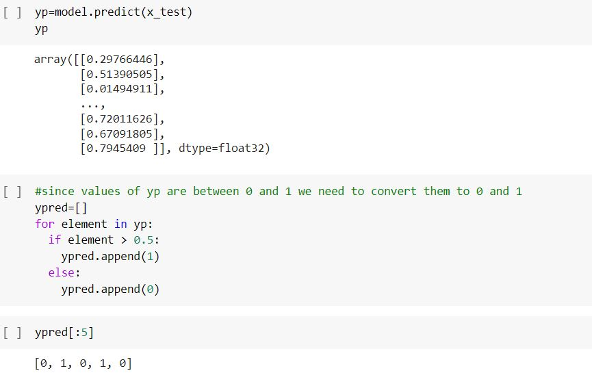

# Project-1 [House Price Prediction]
## Problem Description
Development of civilization is the foundation of the increase in demand for houses day by day.
Accurate prediction of house prices has been always a fascination for buyers, sellers, and bankers also.
Many researchers have already worked to unravel the mysteries of the prediction of house prices. 
Many theories have been given birth as a consequence of the research work contributed by various researchers all over the world.
Some of these theories believe that the geographical location and culture of a particular area determine how the home prices will increase or decrease
whereas other schools of thought emphasize the socio-economic conditions that largely play behind these house price rises.

## Algorithm Selection
We all know that a house price is a number from some defined assortment, so obviously prediction of prices of houses is a regression task. 
Therefore I have experimented with Linear Regression and Decision Trees to find out which one is best.

## Results and Output

# Project-2 [Customer Churn Prediction]
## Problem Description
Customer churn means shifting from one service provider to its competitor in the market.
Customer churn is one of the biggest fears of any industry, particularly for the telecom industry.
With an increase in the number of telecom service providers in South Asia, the level of competition is quite high.
Although there are many reasons for customer churn, some of the major reasons are service dissatisfaction, costly subscription, and better alternatives.
The telecom service providers strive very hard to sustain in this competition. 
So to sustain this competition they often try to retain their customers than acquiring new ones as it proved to be much costlier.
Hence predicting churn in the telecom industry is very important. To reduce customer churn, telecom companies need to predict which customers are at high risk of churn.

## Algorithm Selection
Since it is a classification problem so I have used TensorFlow Sequential Models to train on 26 essential 
features present in the dataset along with sigmoid function to predict whether customer will churn or not.

## Results and Output

# Project-3 [IRIS Dataset Classification using KNN]
Classified flower among three flower categories based 'setosa', 'versicolor', 'virginica' as present in IRIS dataset.
Learned about KNN algorithm.

